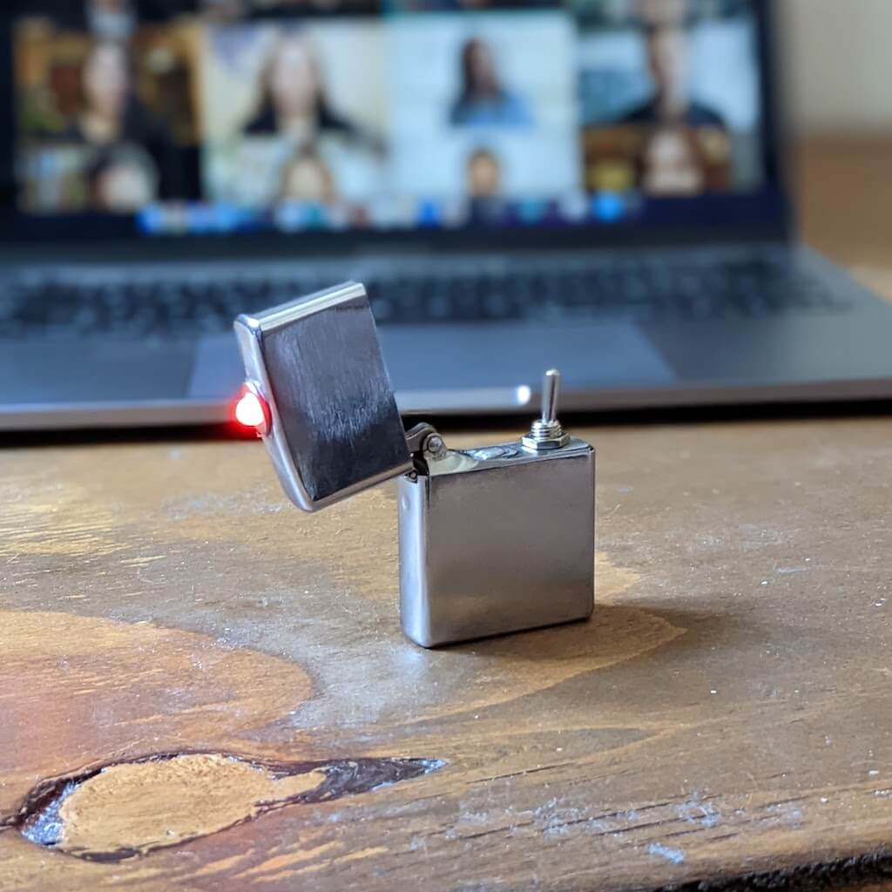

# Zippo Meeting Remote
This code is used to send the keyboard shortcut to mute the microphone in your video call software. With each toggle of the switch, the shortcut is send.

## Hardware requirements
* Zippo lighter
* [Seeed Studio XIAO nRF52840](https://www.seeedstudio.com/Seeed-XIAO-BLE-nRF52840-p-5201.html) (or comparable board, that supports BLE HID)
* [Replacement Battery for iPod nano](https://www.ifixit.com/Store/iPod/iPod-nano-3rd-Gen-Battery/IF134-005?o=1)
* Toggle-switch
* On/Off-switch
* (optional) LED

## Credits
Based on the example code by John Park for Adafruit